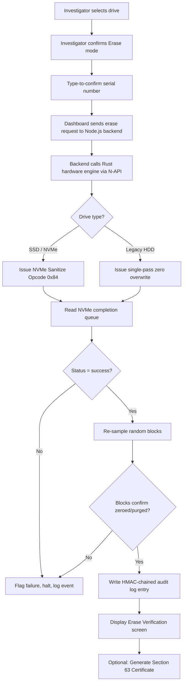
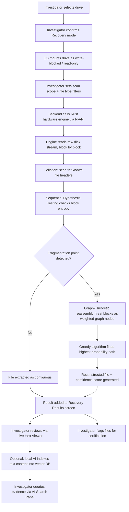
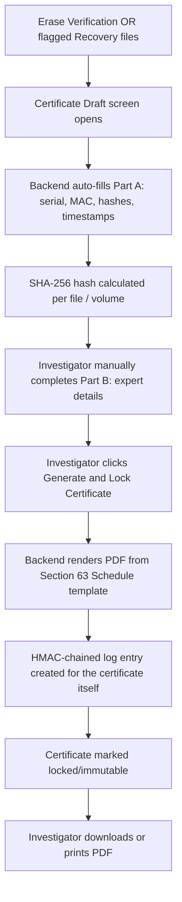
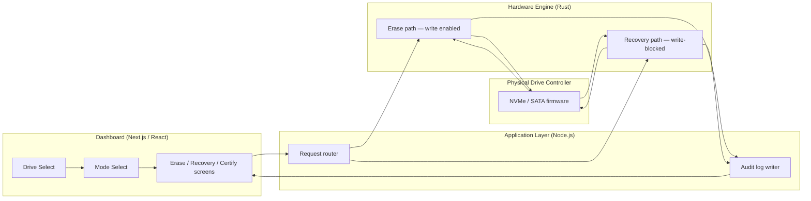

# Nuance-Forensic — UI/UX Design Documentation

**Product:** Unified secure erasure & forensic recovery dashboard
**Audience:** NTRO analysts, cyber forensic investigators
**Purpose of this document:** A single source of truth for every screen, component, and interaction in the dashboard, the data flow behind each core operation, and a step-by-step prompt guide to build the UI from a blank project to a complete module.

---

## Table of Contents

1. [Design Principles](#1-design-principles)
2. [Information Architecture](#2-information-architecture)
3. [Screen-by-Screen Breakdown](#3-screen-by-screen-breakdown)
4. [Component Library](#4-component-library)
5. [Data Flow Diagrams](#5-data-flow-diagrams)
6. [Color & Status System](#6-color--status-system)
7. [Build-From-Scratch Prompt Guide](#7-build-from-scratch-prompt-guide)
8. [Completion Checklist](#8-completion-checklist)

---

## 1. Design Principles

These four rules govern every design decision in this document. If a new screen or button is ever added later, it must be checked against these before it ships.

| Principle | What it means in practice |
|---|---|
| **Mode clarity over speed** | The investigator must never be unsure whether they are in a write-enabled (Erase) or write-blocked (Recovery) session. This is shown persistently, not just at the start. |
| **Nothing is a black box** | Every AI or algorithmic decision (carving confidence, fragment matching) is visible and explained on-screen, not hidden behind a "done" message. |
| **Friction where it matters** | Destructive actions (Erase) get deliberate confirmation friction. Non-destructive actions (Recovery, viewing) do not — investigators shouldn't be slowed down when there's no risk. |
| **Offline-first visual language** | No UI element should imply cloud sync, live updates from a server, or online status — everything must visually read as a local, self-contained tool. |

---

## 2. Information Architecture

```
Dashboard (root)
│
├── Drive Selection Screen
│
├── Mode Selection Screen
│   ├── Erase & Sanitize
│   ├── Recover & Carve
│   └── Certify & Report
│
├── Erase Flow
│   ├── Erase Confirmation Screen
│   ├── Erase Progress Screen
│   └── Erase Verification Screen
│
├── Recovery Flow
│   ├── Recovery Scan Screen
│   ├── Recovery Results Screen (with Live Hex Viewer panel)
│   └── AI Evidence Search Panel
│
├── Certification Flow
│   ├── Certificate Draft Screen
│   └── Certificate Export Screen
│
├── Audit Log Screen (global, always accessible)
│
└── Settings Screen
```

---

## 3. Screen-by-Screen Breakdown

### 3.1 Drive Selection Screen

**Purpose:** The very first screen after login. Nothing touches a drive until the investigator explicitly picks one.

**Sections:**
- **Header bar:** App name/logo, investigator name, case ID input field, offline-status indicator (always shows "Local — no network," never a loading spinner)
- **Connected Drives panel:** A list/table of every drive currently connected to the machine
- **Drive Detail card:** Appears on selecting a drive from the list

**Buttons / Components:**
| Element | Type | Behavior |
|---|---|---|
| Drive row | Selectable list item | Shows serial number, model, capacity, interface (NVMe/SATA), and a "Not yet touched" badge |
| `Refresh Drives` | Secondary button | Re-scans connected devices. No auto-refresh/polling — must be manual, so nothing happens without investigator intent |
| `Select Drive` | Primary button | Disabled until a row is chosen. Advances to Mode Selection Screen |
| Case ID field | Text input | Required before proceeding — ties every downstream action to a case number for the audit log |

---

### 3.2 Mode Selection Screen

**Purpose:** The single most important screen in the app — this is where the write/read-only fork happens.

**Sections:**
- **Selected Drive summary bar:** Persistent strip at the top showing the drive chosen in the previous screen (serial number, model) — never lets the investigator forget which physical device they're about to act on
- **Three large mode cards**, laid out side by side:

| Card | Icon | Description shown | Color |
|---|---|---|---|
| Erase & Sanitize | Eraser | "Permanently destroy data using IEEE 2883 Purge. Write-enabled." | Coral/red |
| Recover & Carve | Puzzle piece | "Scan and reconstruct deleted files. Read-only, write-blocked." | Teal |
| Certify & Report | Certificate | "Generate a Section 63 BSA-compliant certificate for a completed action." | Green |

**Buttons / Components:**
- Each mode card is itself the clickable button — no separate "Go" button, to reduce steps
- A **persistent mode banner** appears at the top of every subsequent screen once a mode is picked (red banner "WRITE-ENABLED SESSION" or teal banner "READ-ONLY SESSION") — this banner is non-dismissible for the rest of that session

---

### 3.3 Erase Confirmation Screen

**Purpose:** Deliberate friction point before any destructive command is sent. This screen exists specifically so an erase can never happen by accident.

**Sections:**
- **Drive summary card:** Full drive details repeated one more time
- **Standard selector:** Choice between "Purge (SSD/NVMe firmware sanitize)" and "Clear (single-pass, legacy HDD)" — auto-suggested based on detected drive type, but overridable
- **Type-to-confirm field:** Investigator must type the drive's serial number exactly before the action button activates
- **Warning text block:** States plainly that this action is irreversible

**Buttons / Components:**
| Element | Type | Behavior |
|---|---|---|
| `Cancel` | Secondary button | Returns to Mode Selection, no action taken |
| `Begin Secure Erase` | Primary destructive button (red) | Disabled until serial number is typed correctly. Triggers the erase pipeline |

---

### 3.4 Erase Progress Screen

**Purpose:** Live status while the hardware engine executes.

**Sections:**
- **Progress indicator:** Determinate bar tied to actual command stages, not a fake animation — stages shown are: `Sending sanitize command` → `Awaiting controller response` → `Reading completion queue` → `Re-sampling blocks`
- **Live log panel:** Scrolling technical log of each IOCTL call issued (for the technically literate investigator who wants to watch)

**Buttons / Components:**
- No cancel button once the sanitize command has been issued to the controller (matches real hardware behavior — a sanitize command cannot be safely interrupted)

---

### 3.5 Erase Verification Screen

**Purpose:** Proves the erase worked — this is what separates the tool from ones that only claim success.

**Sections:**
- **Verification result card:** Pass/fail status pulled from the drive's completion queue response
- **Block re-sample panel:** Shows a random sample of block addresses and their read-back state (zeroed/random), with a visual grid representation
- **Case linkage:** Auto-tags this verification record to the Case ID entered earlier

**Buttons / Components:**
| Element | Type | Behavior |
|---|---|---|
| `View Audit Entry` | Secondary button | Jumps to this event in the Audit Log screen |
| `Generate Certificate` | Primary button | Advances directly into the Certification Flow, pre-filled with this erase event's data |
| `Done` | Tertiary button | Returns to Drive Selection Screen |

---

### 3.6 Recovery Scan Screen

**Purpose:** Configure and launch the carving engine.

**Sections:**
- **Scan scope selector:** Whole drive vs. specific partition/unallocated space only
- **File type filter:** Checkboxes for JPEG, PDF, MP4 (extendable list) — narrows what the carving engine looks for
- **Read-only badge:** Persistent, non-dismissible reminder that this operation cannot write to the drive

**Buttons / Components:**
| Element | Type | Behavior |
|---|---|---|
| `Start Scan` | Primary button | Begins the Sequential Hypothesis Testing + Graph-Theoretic carving pipeline |
| Live progress bar | Non-interactive | Shows blocks scanned / total blocks, updates in real time |

---

### 3.7 Recovery Results Screen

**Purpose:** The most information-dense screen in the app — this is where "nothing is a black box" matters most.

**Sections:**
- **Recovered files grid:** Thumbnail/icon per recovered file, with file type, size, and a **confidence score badge** (e.g., 87%)
- **File detail panel:** Opens when a file is selected — shows:
  - The confidence score, expanded
  - An **explainability log**: plain-language reasoning ("Sequential Hypothesis Testing detected a fragmentation boundary at block 50,000; Graph-Theoretic reassembly selected block 120,000 as the highest-probability continuation")
  - A **Live Hex Viewer** panel — raw hex/ASCII view of the underlying blocks, letting an expert manually verify the carving decision
- **Sort/filter bar:** By confidence score, file type, size

**Buttons / Components:**
| Element | Type | Behavior |
|---|---|---|
| `Export File` | Secondary button, per file | Saves the recovered file to a chosen output location |
| `Flag for Certificate` | Toggle, per file | Marks files to be included in the Section 63 certificate |
| `Open AI Search` | Primary button | Opens the AI Evidence Search Panel (see 3.8) |
| `Proceed to Certify` | Primary button | Enabled once at least one file is flagged |

---

### 3.8 AI Evidence Search Panel

**Purpose:** Lets an investigator query recovered text-based evidence in plain language, entirely offline.

**Sections:**
- **Chat-style query box:** Investigator types natural-language questions (e.g., "Summarize documents mentioning offshore banking")
- **Response panel:** AI's answer, always with source citations linking back to the specific recovered file(s) it drew from
- **Offline indicator:** Small persistent label — "Local model — no data leaves this device"

**Buttons / Components:**
| Element | Type | Behavior |
|---|---|---|
| `Ask` | Primary button | Submits the query to the local model |
| Source file chip | Clickable tag | Jumps back to that file in the Recovery Results Screen |

---

### 3.9 Certificate Draft Screen

**Purpose:** Auto-fills the legal certificate; investigator reviews before export.

**Sections:**
- **Part A (Technical Extraction):** Auto-filled — drive serial, MAC address, SHA-256 hashes, operator ID, timestamps
- **Part B (Expert Verification):** Fields for the verifying expert's name/details — manually entered
- **Linked evidence list:** All files/operations this certificate covers, pulled from flags set earlier
- **Hash chain visual:** Small diagram showing the HMAC-linked audit trail entries this certificate is built from

**Buttons / Components:**
| Element | Type | Behavior |
|---|---|---|
| `Edit Part B` | Secondary button | Unlocks the manually-entered expert fields |
| `Preview PDF` | Secondary button | Shows the exact print-ready output |
| `Generate & Lock Certificate` | Primary button | Finalizes the certificate — once locked, it cannot be edited, only regenerated as a new version |

---

### 3.10 Certificate Export Screen

**Purpose:** Final output.

**Sections:**
- **Certificate preview:** Full-page PDF preview matching the Section 63(4)(c) Schedule format
- **Metadata summary card:** Hash of the certificate itself, generation timestamp

**Buttons / Components:**
| Element | Type | Behavior |
|---|---|---|
| `Download PDF` | Primary button | Saves the certificate locally |
| `Print` | Secondary button | Sends to a connected printer |
| `Return to Dashboard` | Tertiary button | Back to Drive Selection Screen |

---

### 3.11 Audit Log Screen (Global)

**Purpose:** Accessible from anywhere via a persistent sidebar icon. The tamper-evident record of everything the tool has ever done.

**Sections:**
- **Chronological event list:** Every erase, recovery, and certification event, each showing its HMAC chain link to the previous entry
- **Integrity check banner:** Runs a chain-validation check on load — shows a clear pass/fail if any entry appears altered

**Buttons / Components:**
| Element | Type | Behavior |
|---|---|---|
| `Verify Chain Integrity` | Secondary button | Manually re-runs the HMAC chain validation |
| `Export Log` | Secondary button | Saves the full log as a signed file |
| Event row | Clickable | Expands to show full technical detail of that single action |

---

### 3.12 Settings Screen

**Sections:**
- **Supported drive list:** Shows which NVMe/SATA controllers are fully supported vs. flagged unsupported
- **AI model status:** Confirms the local model is loaded and its version
- **About/Compliance panel:** IEEE 2883-2022 and Section 63 BSA version references

---

## 4. Component Library

Reusable components used across the screens above:

| Component | Used in | Notes |
|---|---|---|
| Mode Banner | All post-mode-selection screens | Red (write-enabled) or teal (read-only). Never dismissible mid-session |
| Confidence Score Badge | Recovery Results | Circular badge, percentage + color intensity (higher = more saturated) |
| Drive Summary Card | Drive Select, Erase Confirmation, Certificate | Same component reused for consistency — serial, model, capacity, interface |
| Live Hex Viewer | Recovery Results | Monospace grid, offset column + hex bytes + ASCII column, read-only |
| Hash Chain Visual | Certificate, Audit Log | Small horizontal chain of linked node icons, each representing one log entry |
| Type-to-Confirm Field | Erase Confirmation | Input that only unlocks the next button on exact string match |
| Offline Indicator | Header (global) | Persistent, same position on every screen, never a spinner or "connecting" state |

---

## 5. Data Flow Diagrams

The following are Mermaid diagrams — they render natively in GitHub, GitLab, Obsidian, VS Code (with a Mermaid extension), and most modern Markdown viewers. If your viewer doesn't render Mermaid, paste the code block into [mermaid.live](https://mermaid.live) to see it visually.

### 5.1 Sanitization (Erase) Data Flow



### 5.2 Recovery (Smart Carving) Data Flow



### 5.3 Certification Data Flow



### 5.4 Overall Session / Layer Interaction



---

## 6. Color & Status System

| Role | Meaning | Where used |
|---|---|---|
| **Coral / Red** | Destructive, write-enabled | Erase mode card, mode banner, "Begin Secure Erase" button |
| **Teal** | Non-destructive, read-only | Recovery mode card, mode banner, read-only badges |
| **Green** | Compliant / verified / success | Certify mode card, verification pass status, integrity check pass |
| **Amber** | Caution, needs attention | Unsupported drive warnings, low confidence scores (<50%) |
| **Purple** | Neutral / system-level | Hardware engine references, audit log header |
| **Gray** | Informational / inactive | Disabled buttons, timestamps, metadata text |

---

## 7. Build-From-Scratch Prompt Guide

This section is written so you (or a teammate) can hand these prompts, one at a time and in order, to an AI coding tool (Claude Code, Cursor, v0, or similar) to build the full UI from an empty project to a complete module. Each prompt is followed by an explanation of exactly what it produces and why it's worded that way.

---

### Prompt 1 — Project scaffold

> "Set up a new Next.js 14 project with the App Router, TypeScript, and Tailwind CSS. Add a global CSS file with a dark-mode-first color palette using CSS variables for: bg-primary, bg-surface, text-primary, text-secondary, accent-danger (coral/red), accent-safe (teal), accent-success (green), accent-warning (amber), accent-neutral (purple). Set up a basic app shell with a persistent left sidebar and a top header bar."

**What this does:** Creates the empty skeleton of the whole app and — critically — defines the color system as reusable variables from day one. This matters because the mode banner, badges, and buttons throughout this document all depend on referencing accent-danger and accent-safe consistently rather than hardcoding colors per-component later.

---

### Prompt 2 — Global components first

> "Build three reusable components before any screen: (1) a `ModeBanner` component that takes a `mode` prop of 'erase' | 'recovery' | 'neutral' and renders a full-width colored banner that cannot be dismissed, (2) an `OfflineIndicator` component that always renders a static 'Local — no network' label, never a loading state, (3) a `DriveSummaryCard` component that takes drive serial, model, capacity, and interface as props."

**What this does:** Builds the three components reused across almost every screen in Section 4 first, so later screens can simply import them instead of rebuilding the same UI logic repeatedly — and guarantees visual consistency (e.g., the mode banner looks identical whether it's shown on the Erase Confirmation or Recovery Results screen).

---

### Prompt 3 — Drive Selection Screen

> "Build the Drive Selection screen: a header with a Case ID text input (required), a table/list of connected drives showing serial number, model, capacity, and interface type, a 'Refresh Drives' button that does NOT auto-poll, and a 'Select Drive' primary button that stays disabled until a row is selected. For now, use mock drive data. Clicking 'Select Drive' should navigate to /mode-select and pass the selected drive's data via route state or context."

**What this does:** Builds Section 3.1 exactly as specified, including the deliberate design decision that refresh is manual, not automatic — this is a functional requirement, not just cosmetic, so the prompt states it explicitly rather than leaving it to the AI's default assumption (which would likely be auto-polling).

---

### Prompt 4 — Mode Selection Screen

> "Build the Mode Selection screen at /mode-select. Show the selected drive using the DriveSummaryCard component in a persistent bar at the top. Below it, render three large clickable cards side by side: 'Erase & Sanitize' (coral, eraser icon), 'Recover & Carve' (teal, puzzle icon), 'Certify & Report' (green, certificate icon), each with a one-line description. Clicking a card sets a global 'session mode' state and navigates to the corresponding flow's first screen, and mounts the ModeBanner component on all subsequent screens for that session."

**What this does:** Builds Section 3.2 and wires up the state that Section 3.3 onward depends on — specifically, the "session mode" concept is what makes the ModeBanner persistent and non-dismissible across every following screen, which is the core safety-visibility requirement from the Design Principles.

---

### Prompt 5 — Erase flow (three screens)

> "Build three connected screens for the Erase flow: (1) Erase Confirmation — shows DriveSummaryCard, a standard selector (Purge vs Clear), a text input that must exactly match the drive's serial number before the 'Begin Secure Erase' button (styled with accent-danger) becomes enabled, and a Cancel button. (2) Erase Progress — a determinate progress bar with four labeled stages (Sending command, Awaiting response, Reading completion queue, Re-sampling blocks) and a scrolling technical log panel, no cancel button once started. (3) Erase Verification — a pass/fail result card, a block re-sample visual grid (mock a 10x10 grid of blocks colored green if 'zeroed'), and three buttons: View Audit Entry, Generate Certificate, Done."

**What this does:** Builds Sections 3.3–3.5 in one connected pass since they share state (the same erase operation flows through all three) — the type-to-confirm requirement is called out explicitly because it's a safety-critical interaction, not a generic form field.

---

### Prompt 6 — Recovery flow (three screens + AI panel)

> "Build the Recovery flow: (1) Recovery Scan — a scope selector (whole drive / unallocated space only), checkboxes for JPEG/PDF/MP4 file types, a persistent 'read-only' badge, and a Start Scan button with a live progress bar. (2) Recovery Results — a grid of recovered file cards each showing a circular confidence score badge (color intensity scales with the percentage), a sort/filter bar, and a detail panel that opens on click showing an explainability text log and a monospace Live Hex Viewer (offset | hex bytes | ASCII columns). Add an 'Export File' button and a 'Flag for Certificate' toggle per file. (3) A slide-in AI Search Panel with a chat-style input, a response area that always shows source file citations as clickable chips, and a persistent 'Local model — no data leaves this device' label."

**What this does:** Builds Sections 3.6–3.8. The confidence-score-badge color scaling and the explainability log are called out specifically because they are the "nothing is a black box" design principle made concrete — an AI tool given a vaguer prompt would likely just show a plain percentage number with no reasoning text.

---

### Prompt 7 — Certification flow

> "Build the Certificate Draft screen: auto-filled read-only fields for Part A (drive serial, MAC, SHA-256 hash, operator ID, timestamp — use mock data), editable fields for Part B (expert name, designation, date), a small horizontal hash-chain visual (a row of 4-5 connected circle icons), a Preview PDF button, and a 'Generate & Lock Certificate' button that, once clicked, disables all fields and navigates to a Certificate Export screen showing a full-page PDF preview mock, with Download PDF and Print buttons."

**What this does:** Builds Sections 3.9–3.10, and specifically calls out that the certificate becomes immutable once locked — this is a legal/compliance requirement (evidence integrity), so it needs to be stated as a hard UI rule, not left as an assumption.

---

### Prompt 8 — Audit Log & Settings

> "Build a globally-accessible Audit Log screen (add a sidebar icon that opens it as a slide-over panel from any screen) showing a chronological list of mock log entries, each with a small chain-link icon connecting it visually to the entry above it, a 'Verify Chain Integrity' button that shows a pass/fail banner, and an 'Export Log' button. Also build a simple Settings screen listing supported drive controllers, local AI model status, and a compliance reference panel."

**What this does:** Builds Section 3.11–3.12 as a slide-over rather than a full page navigation, because the Audit Log needs to be reachable without losing the investigator's place in whatever flow they're currently in — a full-page navigation would break that continuity.

---

### Prompt 9 — Connect real state and polish

> "Now connect all screens through a shared React context that tracks: selected drive, session mode, case ID, and a running list of completed actions (erase/recovery/certificate events) that feeds both the Erase Verification 'View Audit Entry' button and the global Audit Log screen with the same data. Add page transition animations, empty states for the Recovery Results grid before a scan runs, and loading skeletons for the Drive Selection table."

**What this does:** This is the final integration pass — up to this point each flow was built somewhat independently with mock data; this prompt is what makes the whole app behave as one connected system rather than a set of disconnected screens, which matters for a live demo where you'll actually move through erase → verify → certify → audit log as one continuous story.

---

## 8. Completion Checklist

Use this to confirm the UI module is fully built before connecting it to the real Rust hardware engine backend:

- [ ] All 12 screens from Section 3 exist and are navigable in the correct order
- [ ] Mode Banner appears and persists correctly on every screen after mode selection
- [ ] Type-to-confirm field correctly gates the Erase button
- [ ] Confidence score badges scale color with percentage
- [ ] Live Hex Viewer renders mock block data in offset/hex/ASCII columns
- [ ] AI Search Panel always shows the offline indicator and source citations
- [ ] Certificate fields lock and become read-only after "Generate & Lock"
- [ ] Audit Log entries visually chain together and integrity check runs on load
- [ ] No screen anywhere shows a loading spinner implying a network call
- [ ] Color roles (coral/teal/green/amber/purple/gray) are used consistently per Section 6, nowhere improvised
